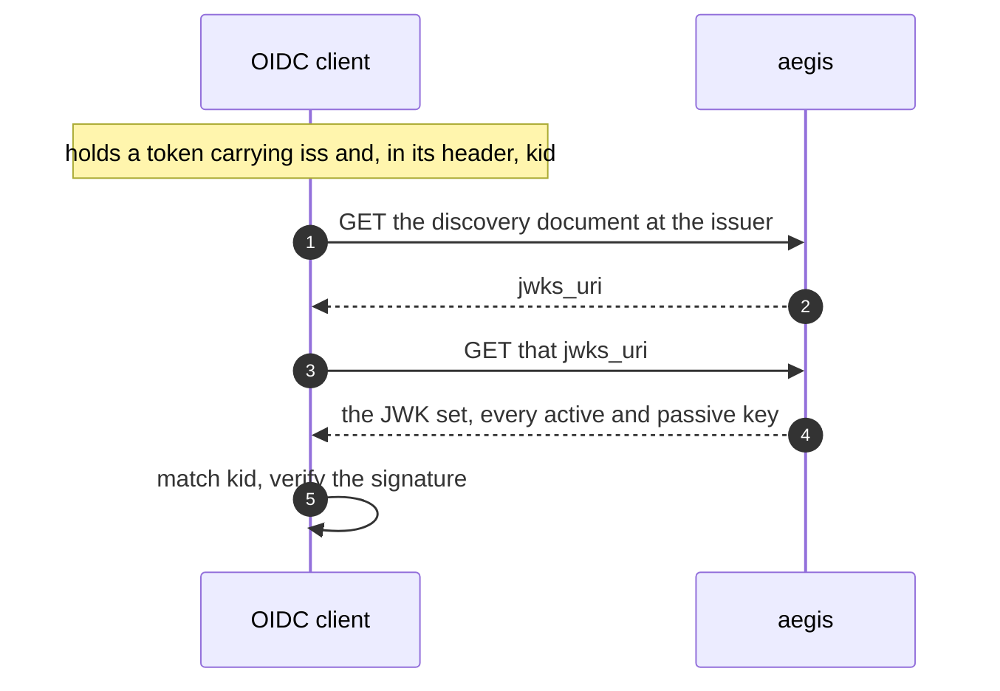
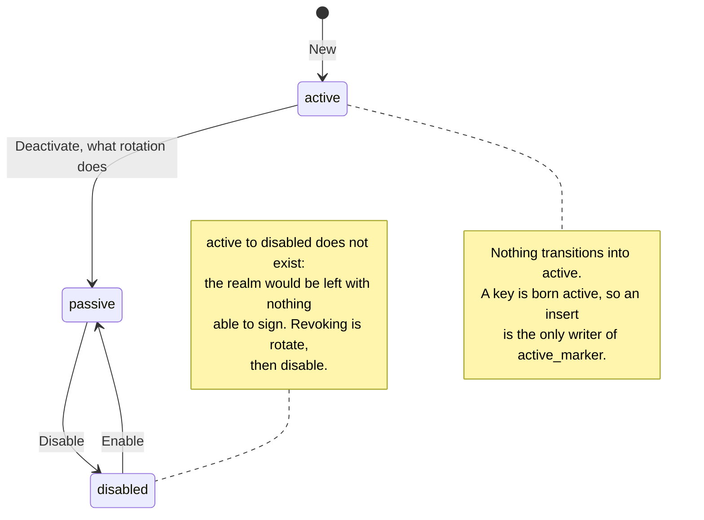
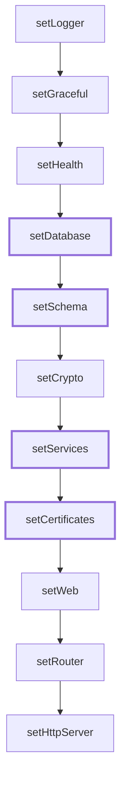
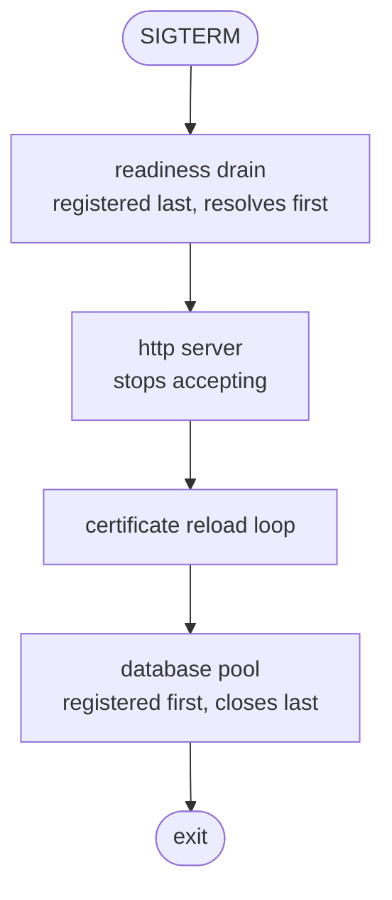
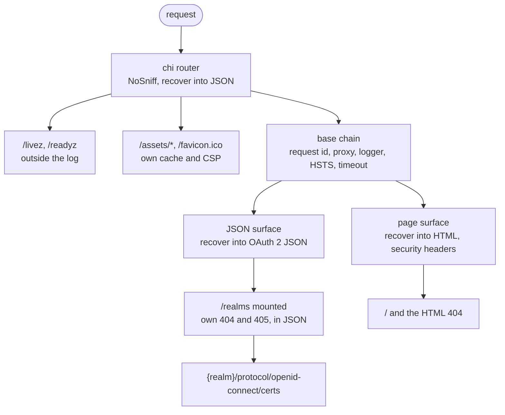

# Architecture

## Layout

```
cmd/aegisd             entry point: signals and exit code, nothing else
internal/application   assembly and lifecycle
internal/cli           subcommand dispatch for `aegisd migrate`, `aegisd key` and their verbs
internal/configs       configuration structs, defaults and validation
internal/domain/realm  the realm aggregate; imports nothing internal
internal/domain/key    the key aggregate; imports nothing internal
internal/service       the use cases; declares the interfaces they consume
internal/repository    implements the service interfaces over GORM
internal/migrations    the embedded schema SQL, one directory per dialect
internal/handler/page  the handlers for the HTML surface
internal/handler/oidc  the handlers for the protocol surface
internal/http          server, middleware, response format
internal/http/assets   fingerprints and serves the static files
internal/http/render   composes layouts with pages and writes HTML, over an injected filesystem
internal/infra         logging, graceful shutdown, health, env parsing
internal/infra/sealer  AES-256-GCM over the installation's master key
internal/infra/keygen  key pair generation
internal/buildinfo     identity of the running binary
internal/templates     owns the embedded templates and assets; declares two filesystems and no behaviour
test/integration       exercises the compiled binary
```

`internal/templates` declares the two embeds and nothing else: a template and an
asset are deliberately separate filesystems, because a template is executed and
never served raw, an asset is served raw, and one filesystem for both would let
the file server hand out `layouts/base.gohtml` as text.

`internal/handler/page` sits at that depth, not under `internal/http`, on
purpose. `internal/http/*` is mechanism — transport, no business rule, no
dependency on domain or service — while a handler is a layer, where a request
becomes a use case call. Keeping the layers at one level is what makes the
dependency rule readable from the tree. `internal/handler/oidc` is beside it
rather than beneath it for the same reason, and the administration API becomes
a third sibling; what separates them is the audience of the answer, not the
depth of the package.

`internal/infra/sealer` and `internal/infra/keygen` are two packages and not
one, because they have two jobs — one encrypts, the other generates — and
because the single package that would hold both would be called `crypto`, which
collides with the standard library in every file that imports the two together.

## Dependency rule

Dependencies point inward. `internal/http/server`, `internal/http/response`,
`internal/infra/graceful` and `internal/infra/health` import nothing internal:
each declares its own `Options` rather than depending on the configuration
structs, so any of them can be built in a test without assembling the whole
application.

Only `internal/application` knows about everything, because wiring is its job.
It is the composition root: it translates `configs` into each package's options,
decides the middleware chain, and lists the resources in startup order.

The interfaces it depends on are declared there too, in `ports.go` and
`resources.go`, never in the packages that satisfy them. `CertificateSource` is
the current one: `internal/infra/certs` does not know it exists, which is what
leaves room for a KMS or an ACME client to answer handshakes later without
either side being rewritten. Anything reaching the outside world is expected to
arrive the same way.

The router is a chi instance, and it exists only inside `internal/application`.
Handlers are `http.Handler` throughout, so no package outside the assembly knows
which router is in use.

## Domain, service and repository

The realm slice adds three packages below `internal/application`, and the
direction of every import between them is the dependency rule made concrete.
`internal/domain/realm` depends on nothing outside the standard library and
`github.com/google/uuid` — it is the innermost layer, and the realm aggregate
lives there with no notion of persistence or transport. `internal/service`
declares the interfaces its use cases consume, `RealmRepository` and `Store`,
rather than depending on whatever ends up implementing them — the same
reasoning the dependency rule above already applies to `CertificateSource`.
`internal/repository` implements those interfaces and therefore imports
`service` to do it, which points the dependency inward rather than outward:
`Store` could not be declared beside its implementation and still typecheck,
since Go requires an interface method's return type to match exactly, and a
method returning a concrete repository type would not satisfy an interface
declared over the abstract one. `internal/application` is the package that
imports all three, because wiring them together is its job: it builds a
`repository.NewStore` over the GORM handle and hands it to
`service.NewRealmService`.

Inside `internal/service` those interfaces are split by who consumes them, not
gathered in one file. A repository interface sits beside its service —
`RealmRepository` and `RealmQuery` in `realm.go`, `RealmKeyRepository` in
`key.go` — so one file shows both the use case and the contract it depends on.
`ports.go` keeps only what crosses more than one use case: `Store`, and the
ports reaching outside the process. The split is worth doing before it hurts:
with two aggregates a single file was 111 lines, and identity, credential,
session and refresh token would each add a repository and its query type.

`Store` stays accessors and `InTx`, nothing else. It is the one interface every
fake in the test suite must implement in full, so a method that did work there
would be paid for in every test that never calls it.

`Realm` carries private fields with accessors and no setter for `id`, `slug`,
`issuer` or `createdAt`, which is what makes the issuer immutable in a way the
compiler enforces rather than a way people have to remember. It has two
constructors for two different origins: `New` is birth — it generates a
UUIDv7, derives the issuer from the realm's slug and the process's public URL,
and validates everything — while `Rehydrate` is the repository's door back in,
and takes the stored issuer as given rather than deriving it. Deriving the
issuer inside `Rehydrate` would recompute every realm's identity from whatever
public URL the reading process happens to hold, which is exactly the drift the
stored `issuer` column exists to prevent: an issuer is derived once, at
creation, and stored, never recomputed on a read.

## Database schema

`internal/migrations` owns the embedded SQL that builds the aegis schema, one
directory per dialect — postgres, mysql, mariadb, sqlite — each covered by its
own `//go:embed` glob and exposed through `For`, which roots the returned tree
at that dialect's directory so the runner sees migration files rather than a
directory of directories. MariaDB has carried its own directory since day one
even though it is byte for byte identical to MySQL today, because splitting it
out later is not possible remotely: an installation that already migrated
carries its lineage in `aegis_schema_migrations`, and there is no way to
retarget that recorded history from where it lives.

That control table is named `aegis_schema_migrations` rather than
golang-migrate's own `schema_migrations` default, because aegis runs on-prem
against a customer's own database and may share it with another application.
If that neighbour also happens to use golang-migrate, a shared table name
would have aegis read someone else's recorded version and apply nothing — with
no error, since golang-migrate has no way to know the version it read was
never its own.

Every migration file holds exactly one statement, and this is forced rather
than merely conventional: the MySQL DSN sets `MultiStatements` to false,
because MySQL and MariaDB have no transactional DDL, so a file carrying two
statements could apply the first and fail the second, leaving a dirty schema
behind. A test enforces the same rule against every dialect, Postgres and
SQLite included, so a violation is caught before it can reach an engine where
it would only fail at the worst time.

A second test, checking that every dialect directory carries the same set of
versions, exists because the per-engine test jobs cannot catch what it
catches: golang-migrate applies whatever it finds in the source and stops
without error, so a version added to three dialect directories and forgotten
in the fourth leaves every job green. The customer running that fourth engine
is the one who discovers it.

`Latest` derives the highest version a dialect carries by reading its
directory rather than from a declared constant, because a constant is one more
thing to forget to bump. An empty directory is an error rather than version
zero, because zero already means "nothing applied yet," and reporting it for a
dialect with no migrations at all would compare the boot's version check
against a lie.

The boot's version check is asymmetric on purpose: a schema older than the
binary is refused, a schema newer than the binary is tolerated. The first half
is what stops a query from reaching a column no migration ever added. The
second half exists for rollback — during a rolling update the previous binary
keeps running beside the new one, which has already migrated the schema
forward, and a binary that refused a version it did not recognise would remove
the ability to roll back exactly when a rollback is needed. A schema recorded
dirty — a prior migration failed and left the state uncertain — is refused
regardless of direction, and recovery is manual: inspect and fix the schema by
hand, then clear the flag with `aegisd migrate force <version>`.

`aegisd migrate` exposes the same subsystem as a subcommand, opening the
database through the same configuration translation the server uses so a
migration never runs under different TLS or pool settings than the process
that will serve traffic. Bare, it applies pending migrations and then verifies
the result the same way boot does. `migrate status` runs no migration at all
and exits 1 when the schema is behind, 2 when it is dirty, which is what makes
it usable as a deployment gate — an init container or a pipeline step that
fails before any replica starts. `migrate force <version>` clears the dirty
flag after a manual repair without touching the schema itself.

## Realm signing keys

An issuer is half of a trust root and a key is the other half. `realm_keys`
carries that half: a row per key, an active RS256 and an active ES256 key per
realm, and the private material encrypted before it ever reaches the database
with a single master key the process reads from the environment.

What a client does with the two halves, and why both have to exist per realm:



Steps 1 and 2 are not served yet: there is no discovery document until the
endpoints exist to advertise, which is phase 2 of the roadmap. Steps 3 to 5 are
what this slice built. A client that already knows the `jwks_uri` — because it
was configured with one — walks the second half today.

Keycloak does not encrypt it. Realm keys live there in `COMPONENT_CONFIG` as
base64 DER in plain text, and confidentiality is delegated downward to disk and
database encryption — a defensible answer for a product that owns the database
it runs on. aegis runs on-prem, inside a customer's own database and possibly
beside another application, and `SELECT * FROM realm_keys` is the first query
anyone with read access there runs. What the master key introduces is a new way
to lose service: no key, no boot, and no realm able to sign. The bound on that
is the whole argument for accepting it — **losing the master key loses no
data.** Signing keys are regenerable. The recovery is a new pair per realm and
clients refetching the JWKS, at the cost of the tokens already issued being
unverifiable for the minutes left in their lifetime. A short outage, not a
loss.

Each row records the `kek_id` of the key that sealed it, and that id is derived
from the key material — `hex(SHA-256("aegis:kek:v1" ‖ key)[:16])` — never
configured. A label an operator chooses can be left behind: change the material
and keep the name, and every row goes on claiming to be openable by a key that
does not open it, with the discovery arriving at the first signature rather
than at the change. Derived, the id moves whenever the material does, and the
domain prefix keeps the stored value from being a bare hash of the secret.

The associated data binds each ciphertext to `realm_id ‖ kid`, so a row lifted
into another realm's rows does not open — the tenancy boundary held by the
cipher and not only by a `WHERE` clause, in a product whose worst failure is
leakage across exactly that line. It is the `kid` and not the row's `id` for a
mechanical reason: `key.New` generates the `id` and needs the sealed blob to
build the aggregate, while the `kid` derives from the public key and therefore
exists before either of them. It binds just as tightly, being a hash of the very
key being sealed.

The `kid` itself is the RFC 7638 thumbprint of the public key — the canonical
JWK of the required members only, hashed with SHA-256, base64url without
padding, 43 characters. A random identifier would work for keys aegis
generates and stops working at the first key someone imports: the same key
loaded twice would take two identities instead of colliding on
`uq_realm_keys_kid`, and a `kid` in a token could not be checked against a key
recomputed from scratch. The thumbprint and the published JWK are built from
one function in `internal/domain/key`, not two, because two constructions of
the same canonical object are the pair that eventually disagrees — and
disagreeing here means a `kid` that does not identify the key it is attached
to.

"One active key per realm, purpose and algorithm" is naturally a partial unique
index, `WHERE status = 'active'`. Postgres and SQLite have those; MySQL and
MariaDB have neither partial nor filtered indexes, and a functional index over
an expression is not the same thing. So the rule moves into a column:
`active_marker` holds `'y'` on an active row and `NULL` on every other, and a
plain unique index covers it, resting on the one property all four share —
NULLs do not collide in a unique index. `ck_realm_keys_marker` keeps the marker
from lying, forcing `active_marker IS NOT NULL` to hold exactly when the status
is `active`; both sides of that equality are non-nullable expressions, so it
never evaluates to NULL and never passes by accident. The marker has no field
on the aggregate and is derived by the repository, because it is not a fact
about a key — it is the mechanism behind one rule, and a field would let a
caller set it.

The statuses the marker tracks, and the transitions the aggregate refuses:



`Enable` returns a key to passive and never to active, for the same reason:
putting a key back into service is a rotation.

Unlike `realms`, which declares its unique rules as named table constraints,
these are indexes. SQLite has no `ALTER TABLE DROP CONSTRAINT`: changing a
named constraint there means creating a new table, copying the rows, dropping
the old one and renaming — four statements against a table holding live key
material — while a unique index is `DROP INDEX` and `CREATE INDEX` on all four
engines. The rule most likely to change is this exact one, on the day `purpose`
admits `'enc'` or the day the active key stops being per algorithm, so it is
written in the form that can be changed. `realms` is left alone; rewriting it
now buys nothing.

A realm and its keys are written in one transaction, which is what makes a
realm without keys unrepresentable — the same reasoning that made `pending` an
impossible realm status. There is no window in which a realm exists and cannot
sign, so no caller has to handle one. The generation, though, is deliberately
outside that transaction: RSA-2048 costs on the order of hundreds of
milliseconds, and a transaction open across it holds a pooled connection — and
whatever it has already written — for the length of a computation that touches
no row. `KeyService.Prepare` takes no
context and no database for that reason — it generates, seals, and builds the
aggregates — and the caller persists the result inside a transaction it owns.
`RealmService` holds the `*KeyService` rather than a third service being
introduced to call the two in order, which would be a layer for a three-step
sequence.

The JWKS is served at `/realms/{slug}/protocol/openid-connect/certs`, which is
Keycloak's path exactly. No specification requires any particular one — clients
arrive through `jwks_uri` in the discovery document — so the only argument
available is compatibility with the product customers migrate from, and it is
the one taken. `certs` is a misnomer inherited along with it: what is served is
public keys, and aegis issues no certificates for them. The media type does not
follow the same argument: it is `application/jwk-set+json`, the one RFC 7517
registers, where Keycloak answers `application/json`. Every client library
parses the body without inspecting the type, so compatibility buys nothing here
and there is nothing to trade against being correct. The document is ordered by
`id` descending rather than by `created_at`, because the ETag is hashed over
the rendered bytes and `created_at` gives no deterministic order: on SQLite it
is `TEXT` written as RFC 3339 with trailing zeros trimmed, where `…:00Z` and
`…:00.5Z` sort by comparing `Z` against `.` and the row without a fractional
part sorts *after* the one that has it. A UUIDv7 in canonical form is
fixed-width hexadecimal with the timestamp in its leading bits, so ordering by
`id` is chronological on the three dialects storing it as text and on Postgres,
which compares `uuid` by byte value.

Every protocol endpoint turns a slug into a realm through
`RealmService.Resolve`, so the status rule lives in one place instead of being
remembered at each one.
An archived realm answers 404: its row exists to keep its slug and issuer
occupied, so that cached discovery and dead tokens cannot follow them to a new
realm, and not to serve anything. A **disabled** realm serves its JWKS
normally, which is the counterintuitive half. Withholding the document revokes
nothing — the tokens already signed stay valid until they expire — and all it
achieves is making "realm disabled" indistinguishable from "key rotated" for
every client holding one. A realm whose keys are all disabled answers `200`
with `{"keys":[]}` rather than 404, for the same distinction: the realm exists,
it has nothing to publish.

`SignerSource` hands back a `crypto.Signer` and the `kid`/`alg` pair a JWS
header carries, rather than the private key. That shape is what lets a KMS
replace the implementation whole instead of a part inside it: a KMS never
returns private material, so "open the seal and parse the PKCS#8" has no
analogue there, while "give me something that can sign for this realm" does —
and `crypto.Signer` is the standard library's own name for signing without
being handed the key. It is the arrangement `CertificateSource` already has,
where what changes is on the far side of the interface and no caller is edited.
The shape leaves one trap for whoever assembles the first JWS:
`ecdsa.PrivateKey.Sign` produces an ASN.1 DER signature, while JWS ES256
requires the fixed-width `R ‖ S` concatenation — 64 bytes for P-256, each half
left-padded. A DER signature in a JWS is accepted by nothing. RS256 has no
equivalent problem, since `rsa.PrivateKey.Sign` with `crypto.SHA256` is already
the PKCS#1 v1.5 signature that `alg` names.

There is no signer cache. Opening a seal and parsing a key is cheap next to the
round trip that fetched the row, nothing signs per request until tokens exist,
and a cache added now would be an optimisation with no measurement behind it —
carrying a problem of its own, since a rotation performed on one replica leaves
every other one signing with what it cached. That is a question for the slice
that has a consumer to measure.

## Startup

`main` parses nothing and holds the single exit point. Everything else lives in
`run`, so deferred calls still happen — `os.Exit`, which a fatal log ends up
calling, skips them.

`application.New` walks a list of steps and can fail. `setDatabase` is the
first one that actually does: it is the first step reaching the outside
world, opening the pool and registering the readiness check before anything
later in the list can run. Every step shares its `error` return because of
this one — the signature was there in anticipation, so a dependency reaching
the outside world did not force the assembly to be rewritten, and a connection
failure surfaces as an error instead of a panic inside a constructor.

The list now reads `setLogger`, `setGraceful`, `setHealth`, `setDatabase`,
`setSchema`, `setCrypto`, `setServices`, `setCertificates`, `setWeb`,
`setRouter`, `setHttpServer`. `setSchema` brings the database up to the version
this binary carries — applying pending migrations only when migration on boot
is enabled — and then verifies the schema version regardless of whether a
migration ran: the check is not conditional on it, because an operator who
forgot `aegisd migrate` with migration on boot disabled would otherwise serve
requests until the first query touched a missing column. `setServices` builds
the store, the key service and the realm service, and then seeds the master
realm; it is a step of its own, separate from `setSchema`, because the seed
needs services something has to own — built as locals instead, the admin API
would end up constructing a second set that is not the application's.



The thick nodes are the steps that reach outside the process, which is what
makes the shared `error` return earn its place. `setCrypto` is not one of them:
it can fail, but only over values the configuration build already resolved.

`setCrypto` sits between them and builds the sealer from the `crypto` section.
It is a step rather than a few lines inside `setServices` because
`setServices` seeds keys and cannot run before a sealer exists. It reaches
nothing outside the process: a `_FILE` secret was already read during the
configuration build, in `envtools.LookupSecret`, and what happens here is a
base64 decode and an AEAD construction over values already in memory. It is where
"no master key, no boot" stops being a validation rule and becomes true of the
process — in every profile, because there is no development fallback. A
constant compiled in would be a decryption key every installation shares, and
would put safety in a guard that refuses it rather than in the secret not
existing. A process holding a *previous* master key logs an `INFO` saying so,
since it means a rewrap is in flight and unfinished.

The seed's time budget changed meaning with it. It borrows
`database.connect_timeout` — ten seconds by default — and that used to cover a
few single-row round trips on an already open connection. On a first boot it
now also covers generating the master realm's two key pairs. RSA-2048 and P-256
fit inside it comfortably, but the borrow is no longer only about round trips,
and anyone tuning `connect_timeout` down should know what else is being cut.
The `master realm ready` line carries the active `kid` per algorithm — active only, because the log encoder appends fields without deduplicating and the passive keys would repeat `kid_RS256` after a rotation, because
that is the first thing anyone looks for when a client reports a signature it
cannot verify.

The seed only ever reads and writes the master realm's issuer, never its
status: an operator who disabled the master realm did so on purpose, and the
boot has no business reversing that. When the stored issuer already matches
what this process derives from its configured public URL, the seed leaves the
realm untouched. When it does not, development and production diverge for
reasons that belong to each: development rewrites the stored issuer, because
its public URL is derived from the listener and changing the port would
otherwise leave a stale issuer with no symptom pointing at the cause;
production refuses to boot instead, because every client validates the issuer
byte for byte, and discovering after the fact that every one of them rejected
the new issuer is worse than not starting.

Keys are seeded under the same restraint, and after the realm is settled rather
than inside creation, because an adopted or reissued master realm reaches that
point without having gone through creation at all. The seed reads the active
keys first and generates only the algorithms that are missing — without the
read, every boot would burn two key generations to discard them — and it never
rotates, never disables and never reconciles a key that already exists. Two
replicas seeding at once resolve the way the realm seed already resolves its
own: migration holds a session lock and the seed does not, so both generate,
both insert, `uq_realm_keys_active` rejects one, and the replica that lost
re-reads and adopts the row that won instead of failing the boot.

## Shutdown

Resources register a shutdown pending with `internal/infra/graceful`. Pendings
resolve in reverse registration order, like `defer`, so registering in startup
order means the HTTP server stops accepting requests before the database closes.

Readiness draining is registered last and therefore resolves first: on `SIGTERM`
`/readyz` starts failing while the server is still accepting connections, giving
the load balancer time to take the instance out of rotation. Only then does the
server stop accepting. The database registers before both — the resources and
the drain pending alike — so it is the last one open: nothing closes it until
the server has drained and stopped accepting, and no in-flight request can be
turned into a connection error by a pool that closed too early.



A pending that fails does not stop the others — the goal is to close as much as
possible before the process dies. A second signal abandons what is left and
exits with a failure status.

## HTTP

The middleware chain, outside in: request id, request logger, panic recovery,
request timeout. Request id comes first so the logger and the recoverer both
carry it; the recoverer sits inside the logger so the 500 it produces appears on
the request line.



The probes are mounted outside that group. The orchestrator polls them every few
seconds per replica, which would bury real traffic in the request log. Assets
are mounted bare alongside them, for the same reason: a stylesheet request is
not a page view. Both still pass through a recoverer, so a panic answers a
status rather than dropping the connection.

Behind that, two groups share the base chain — request id, the forwarding
decision, the request logger, HSTS where enabled, the request timeout — and
diverge only in how each closes it. The API surface recovers into JSON, the
same writer the bare-mounted probes and assets fall back on. The page surface
recovers into HTML and layers the security headers on top of the chain, so an
unhandled panic still renders as a page rather than a JSON object a browser
would show as text.

`/realms` is a mounted mux inside the API group rather than routes registered
inline on it, and the difference is the 404. chi assigns an inline group's
`NotFound` and `MethodNotAllowed` to the parent mux, so a group cannot scope
its own — setting one there would replace the service's for everything, page
surface included. Only `chi.Mount` builds a mux that carries handlers of its
own. Without the mount, a wrong path under `/realms/...` would fall through to
the page surface and answer an HTML 404, and an HTML document is the wrong
reply at a protocol endpoint: it is read by a client library, not by a browser.
The branch exists now, with its own 404 and 405 in the OAuth 2 error format,
so that every protocol endpoint added later lands inside it rather than
recreating the decision.

The response format comes from the route group, never from the `Accept`
header. Negotiating it on the error path would make the format depend on
something the caller controls — the caller who broke the request being the one
to decide the shape of the answer. The group is fixed at registration, so it
cannot be.

Assets carry their own guarantees instead of the chain above: `nosniff`, a
`Content-Security-Policy: default-src 'none'`, and a `Cache-Control` good for a
year, because the path itself is fingerprinted by the content's hash and changes
the moment the file does. That hash is verified again on every request rather
than merely stripped off the URL, which is what keeps the year-long promise
honest instead of a name for whatever happens to be sitting behind it. The
policy is there for one route in particular: `/favicon.ico` answers
`image/svg+xml`, and an SVG navigated to directly is a document that can execute
script — harmless for an icon committed to this repository, and the wrong
default the day a realm's own logo is served from the same code.

The page surface's CSP carries no `unsafe-inline` and no `unsafe-eval`
anywhere in it, so no template may carry a `<style>` block, a `style=`
attribute, an inline event handler or an inline `<script>`. That constraint
landed with the first page rather than after the console arrived: retrofitting
it later would mean rewriting every template already written under a looser
policy. A test in `internal/templates` walks the embedded `.gohtml` files and
fails on any of the four, so the rule is enforced rather than remembered.

Errors are written in the OAuth 2 format of RFC 6749 section 5.2, which is what
the endpoints of this service speak.

## Health

Liveness and readiness answer different questions. A failing liveness gets the
container killed and restarted; a failing readiness only takes it out of
rotation.

Liveness therefore checks nothing external. A slow database would otherwise fail
every replica at once and have all of them restarted, turning a degradation into
an outage.

Readiness runs the registered checks concurrently, so a probe costs the slowest
check rather than their sum. Each one reports as an object, the same shape in
every profile, so what changes between them is how much is inside it:

```json
{"status":"ready","checks":{"database":{"status":"ok"}}}
```

Outside development that is all of it. The verdict is public because a check
name says which dependency is down and nothing else; what stays in is the
failure itself and anything a check describes — the server, the pool, the
version — since those describe internal topology on an endpoint reachable from
outside. Under the development profile the whole description is rendered, and
that is also where an ordered shutdown is distinguishable: draining runs no
checks at all, so it is the one `not_ready` with nothing in `checks`.

A failure is logged whatever the response shows. The probe is a moment and the
public report may withhold the reason, so the reason is recorded either way.

The detailed variant reports the description in any profile, and exists for the
authenticated administration surface.
